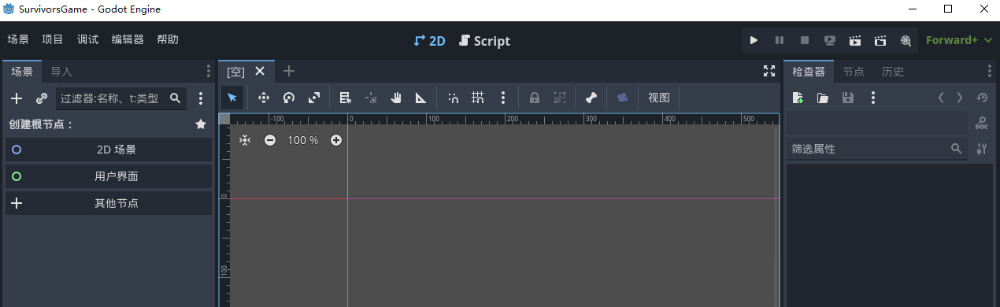
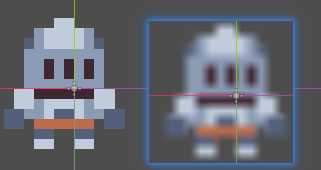
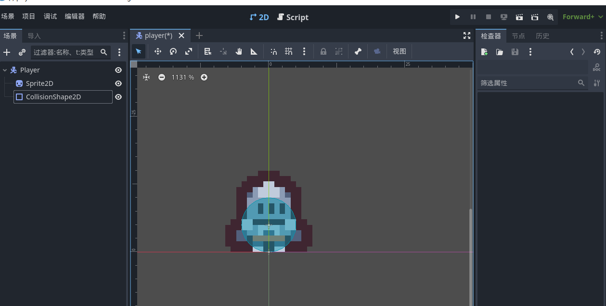

# 设置

调整顶部资源栏操作： 菜单栏-》编辑器-》编辑器功能 

# 图片纹理设置

菜单栏=》项目=》项目设置=》常规=》渲染=》纹理=》默认纹理=》就近渲染

前后效果

# 设置人物流程

> `CharacterBody2D`: 专门用于通过脚本移动的角色的 2D 物理物体。

> `Sprite2D`: 通用精灵节点。（本质用来放图片）

> `CollisionShape2D`: 2D碰撞节点

最终效果

